Estudo Engenharia Eletrônica e de Telecomunicações na UNESP. Antes disso cursei um ano de Engenharia de Controle e Automação no IFSP, onde peguei gosto por construir coisa que funciona de ponta a ponta: circuito, código e interface.

Front-end virou o meu foco. Trabalho com HTML, CSS e JavaScript puro, e a parte que mais me interessa é o movimento: como a página se comporta enquanto a pessoa rola, e quanto isso custa de performance.

No meu portfólio não existe nenhuma biblioteca de animação. Está tudo escrito à mão, e a maior parte do esforço foi diminuir o trabalho que o navegador precisa fazer a cada quadro.

<b>as decisões técnicas por trás disso</b>

 

A primeira versão tinha nove listeners de scroll e doze de resize, cada módulo com o seu próprio `requestAnimationFrame`. O que mudou depois:

**Uma agenda única.** Um listener de scroll e um de resize para o site inteiro, com duas filas por quadro: primeiro todos medem, depois todos escrevem. Leitura de layout que vem depois de uma escrita obriga o navegador a recalcular na hora. Separando as passadas, o cálculo acontece uma vez só por quadro. Eram 0,40 ms por quadro nisso, o que num celular vira 1,6 a 3,2 ms.

**`window.scrollY` lido uma vez por quadro.** Ele não é uma variável, é uma consulta que força recálculo se o layout estiver sujo. A barra de progresso lia uma vez, o marquee lia duas, e as três leituras caíam na passada de desenho, depois de todo mundo já ter escrito.

**Handle do rAF no lugar de um booleano.** Se o callback não chega a rodar, com a aba em segundo plano ou com o Safari suspendendo o rAF no meio de um gesto, o booleano fica travado e o scroll do site inteiro para. Chegou a acontecer: página carregada em aba de fundo deixava a seção de scroll horizontal com `height: 0`. Guardando o handle dá para cancelar e pedir de novo, e o `visibilitychange` descarta quadro pendurado.

**Marquees sem JavaScript.** Viraram `animation` no CSS e rodam no compositor. O JavaScript que sobrou ali só calcula a duração, para a velocidade ficar igual em faixas de larguras diferentes.

**Efeito de mouse só onde existe mouse.** Cursor, tilt e parallax verificam `(hover: hover) and (pointer: fine)` antes de ligar. Em tela de toque não fazem sentido e só gastam bateria.

**`prefers-reduced-motion` como ponto único de verdade.** Quem tem "reduzir movimento" ativo no sistema recebe a versão estática de tudo.

## Projetos

**[fernandomcruz.com.br](https://fernandomcruz.com.br)** · [código](https://github.com/fernandomcruz/portfolionovo)

Meu portfólio, design e código meus. Cursor customizado, marquees, revelações no scroll e uma assinatura que se desenha em Canvas. É onde está tudo que descrevi acima.

**[L&D Engenharia](https://ldengenharia.netlify.app/)** · [código](https://github.com/fernandomcruz/L-D-Empresa-Junior)

Site institucional de uma empresa júnior de engenharia, com serviços, projetos, equipe e contato. Segui a identidade visual que eles já tinham. Aqui a prioridade era o oposto do portfólio: nada de efeito atrapalhando quem só quer achar o contato.

**[Smartband Acessível](https://sites.google.com/view/caosifsp/p%C3%A1gina-inicial)** · IFSP

Pulseira de monitoramento de saúde voltada à segurança de idosos, com medição de batimentos, temperatura e detecção de quedas. Hardware em ESP32 com sensor MPU montado em protoboard, caixa projetada por mim em AutoCAD, lógica de controle e processamento em Python e C#, e a interface de monitoramento em HTML, CSS e JavaScript. O sistema envia alerta em tempo real para o aplicativo.

## Stack

Português nativo, inglês intermediário.

## Formação

- **UNESP** · Engenharia Eletrônica e de Telecomunicações · 2026 a 2029, no segundo ano
- **IFSP** · Engenharia de Controle e Automação · 2025 a 2026

**Cursos**

- **Desenvolvimento Web Completo** · Udemy, desde março de 2025, em andamento. HTML5, CSS3, design responsivo, Bootstrap 4, Flexbox e JavaScript, com um projeto ao final de cada módulo.
- **Python** · Santander Open Academy, fevereiro de 2025. Estruturas de dados e de controle, tratamento de exceções e resiliência de código.
- **Inglês** · Influx, 2015 a 2019, até o nível intermediário.

## Contato

Procuro estágio ou vaga júnior em front-end.

[e-mail](mailto:fernandomarquecruz@gmail.com) · [linkedin](https://www.linkedin.com/in/fernando-marques-da-cruz-105029346/) · [instagram](https://www.instagram.com/_ferd14_/)
